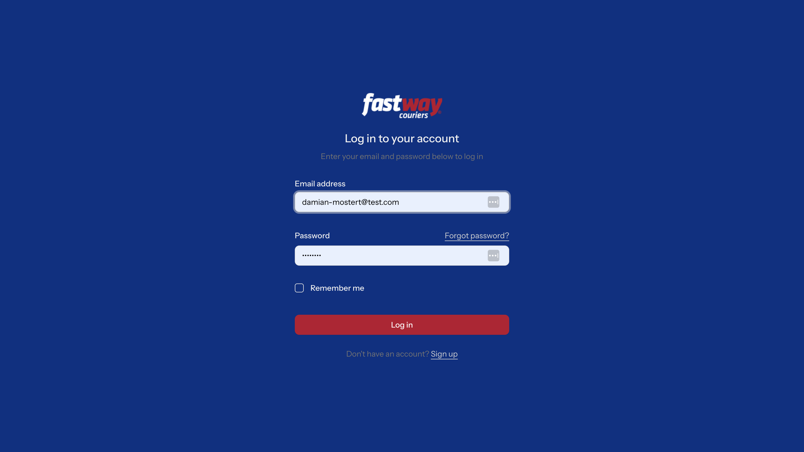
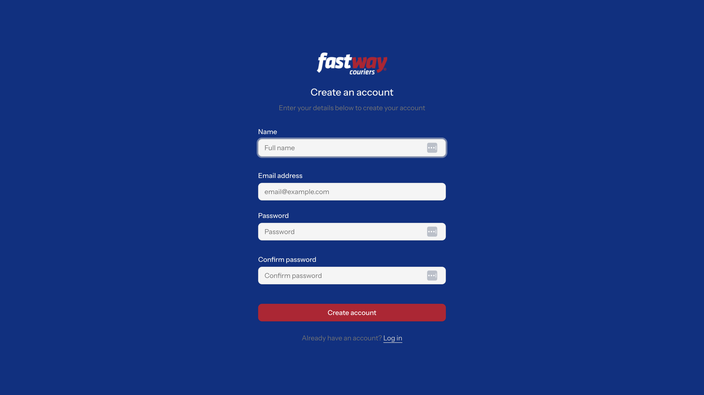
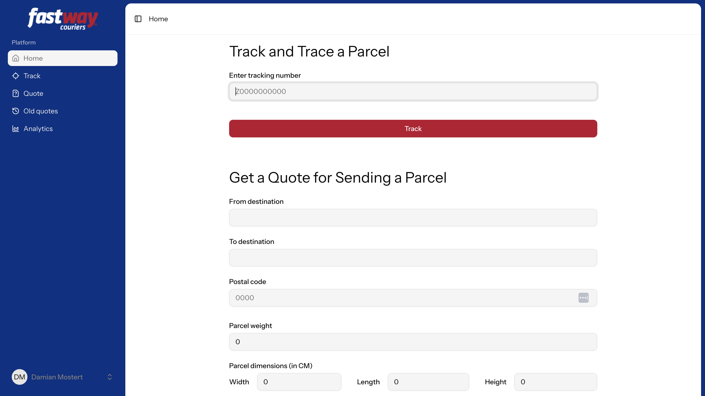
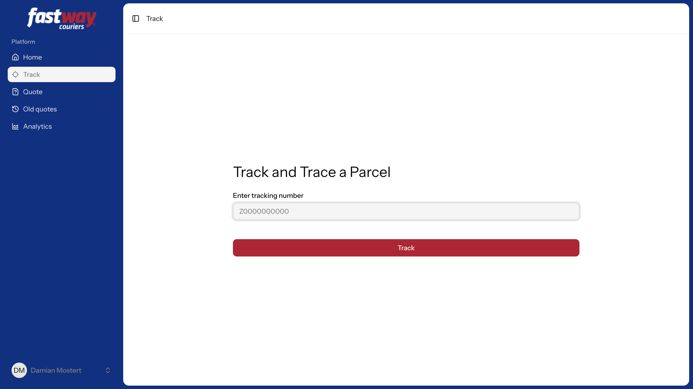
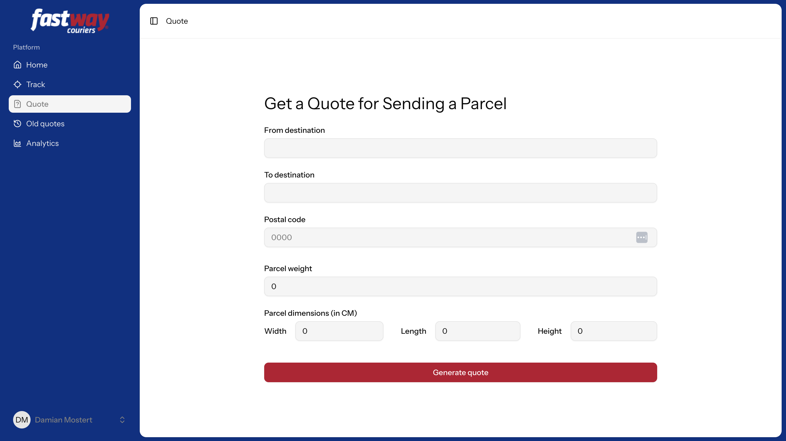
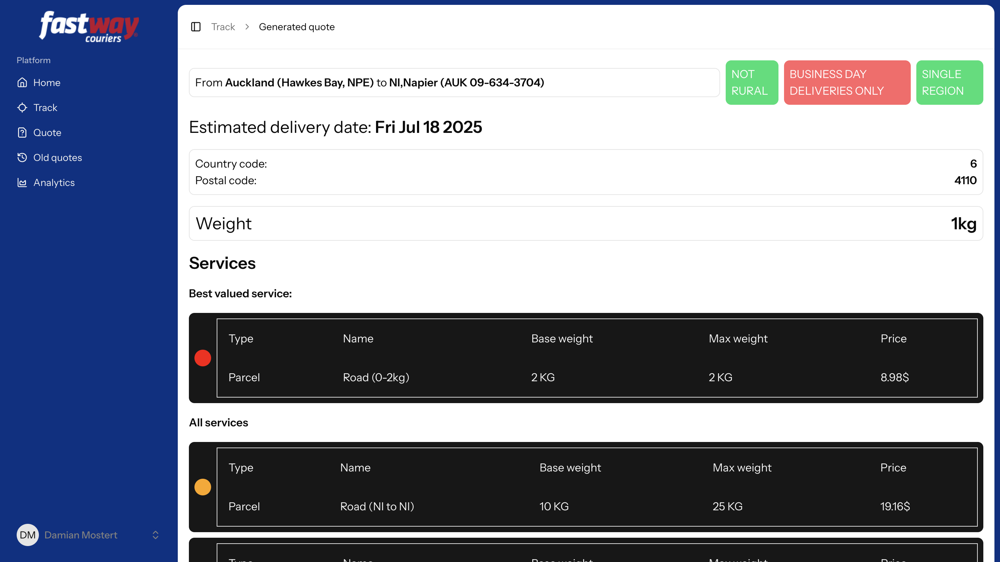
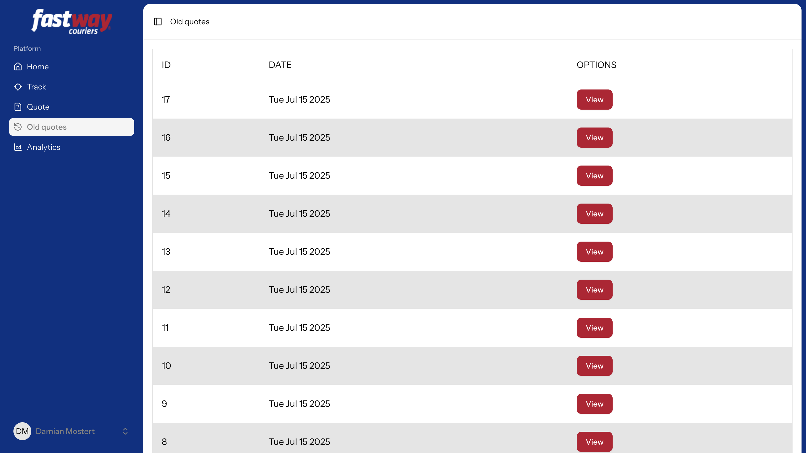
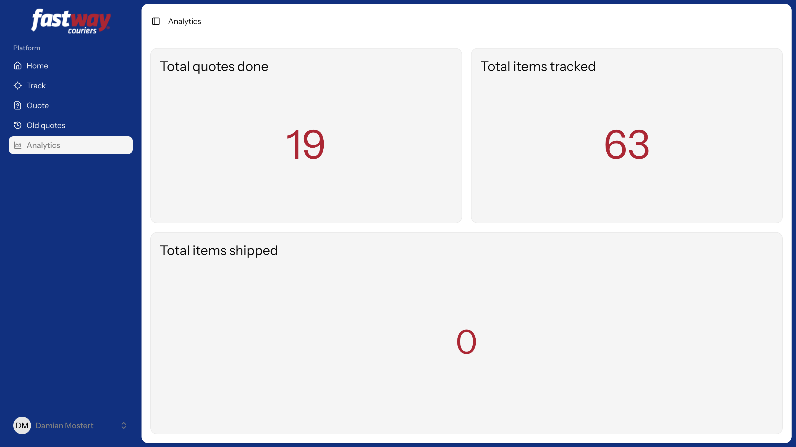
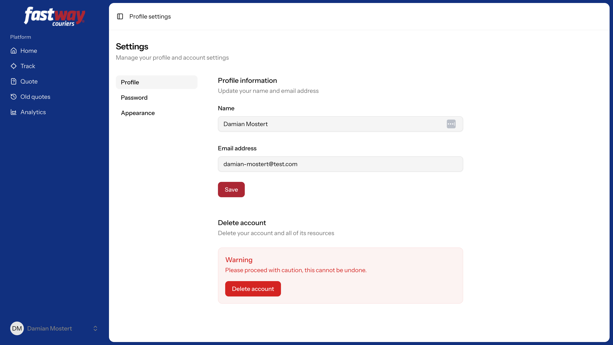
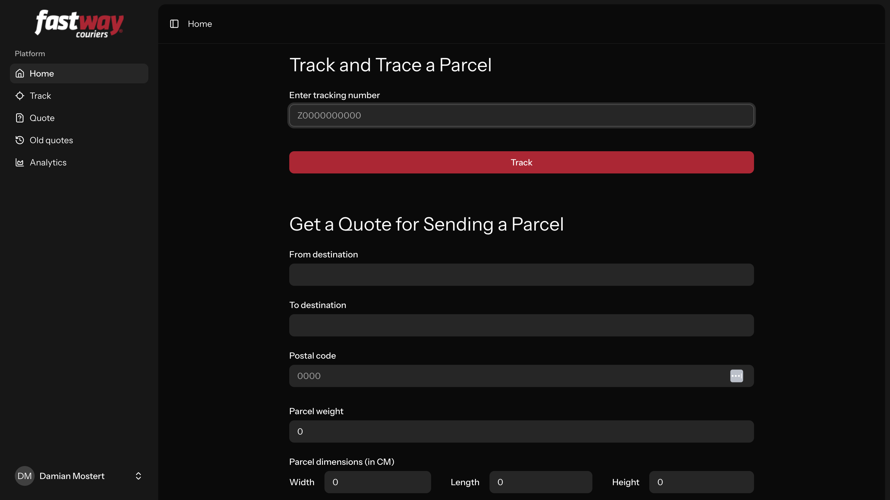

# Startup

Please see Laravel documentation about env config.

Based off of the [Laravel React Starter kit](https://github.com/laravel/react-starter-kit), Re skinned and modified to be a dashboard for Fastway parcel tracking and quotes.

###### To install dependencies pleas run
```bash
yarn install && composer install
```
###### To do database migrations please run
```bash
php artisan migrate
```
###### To run the server please run
```bash
npm run build && php artisan serve
```
Server runs on port [8000](http://localhost:8000)

## Pages

#### Login

#### Register

#### Home

#### Track

#### Quote

#### Generated Quote

#### Old Quotes

#### Old Quote

#### Analytics

#### Settings

#### Dark mode

